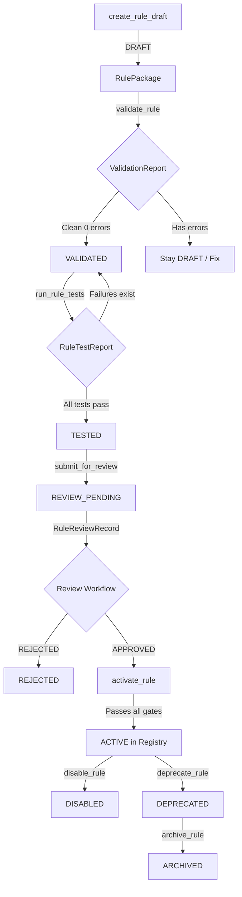

# Astrolife V2 — Phase 6C Architecture & Design

## 1. Architectural Scope
Phase 6C provides the **domain layer and backend infrastructure** for the Developer Rule Lab. The Developer Rule Lab is responsible for managing the lifecycle, testing, verification, activation, diffing, and auditability of dynamic astrology rules.

### Core Architectural Principles
1. **Safety Boundary**: All rule definitions are purely declarative data (no Python code execution). No `eval`, `exec`, `import`, or shell payloads are tolerated.
2. **Deterministic Reproducibility**: Rules and test executions do not depend on system wall-clock time, random IDs, memory addresses, or filesystem paths.
3. **Explicit State Transitions**: Rules progress through an explicit 9-state lifecycle machine (`DRAFT` → `VALIDATED` → `TESTED` → `REVIEW_PENDING` → `ACTIVE` → `DISABLED` / `DEPRECATED` → `ARCHIVED`). Direct or silent activation (e.g. `DRAFT` → `ACTIVE`) is strictly forbidden and raises `LifecycleTransitionError`.
4. **Version Immutability & Coexistence**: Any modification to an existing rule requires a new version. The prior version remains untouched and historic evaluations remain 100% reproducible.
5. **Separation of Rule Creation and Execution**: A rule in `DRAFT`, `VALIDATED`, `TESTED`, or `REVIEW_PENDING` state cannot be evaluated as an active production rule in the registry.

---

## 2. Component Architecture

---

## 3. Core Models & Abstractions

### `RulePackage`
The canonical container encapsulates:
- `rule_id`, `version`, `name`, `description`, `tradition`, `category`
- `provenance`: `RuleProvenance` (source reference, verification status, confidence)
- `semantics`: `RuleSemantics` (formation, cancellation, mitigation condition trees, derived facts)
- `dependencies`: `RuleDependencies` (input facts, rule dependencies, vargas, dashas, transits, strengths)
- `evidence`: `RuleEvidenceSpec`
- `lifecycle`: `RuleLifecycle` (current status, effective from, supersedes, deprecated by)
- `validation`: `RuleValidationInfo`
- `test_cases`: Declarative list of `RuleTestCase`
- `validation_report`: Optional `ValidationReport`
- `test_report`: Optional `RuleTestReport`
- `activation_metadata`: Optional `ActivationReport`

### `RuleHealth`
Structured health status avoiding arbitrary numerical scoring:
- `schema_valid: bool`
- `provenance_valid: bool`
- `dependencies_valid: bool`
- `security_valid: bool`
- `tests_passed: bool`
- `regression_status: str` (`"STABLE"` | `"REGRESSION"` | `"NO_BASELINE"`)
- `lifecycle_status: str` (`"DRAFT"`, `"VALIDATED"`, `"ACTIVE"`, etc.)
- `activation_status: str` (`"ACTIVE"` | `"INACTIVE"`)

### `RuleDiff`
Structured semantic diffing between two rule versions:
- `categories: Dict[str, List[str]]`:
  - `ADDED_CONDITION`, `REMOVED_CONDITION`, `CHANGED_CONDITION`
  - `ADDED_DEPENDENCY`, `REMOVED_DEPENDENCY`
  - `CHANGED_PROVENANCE`, `CHANGED_TRADITION`
  - `CHANGED_CANCELLATION`, `CHANGED_MITIGATION`
  - `CHANGED_METADATA`
- Stably sorted string outputs.

### `RuleLabService`
Coordinates the developer workflow:
- Draft creation and registration
- Schema and DSL validation
- Test suite execution against synthetic or golden chart fixtures
- Review workflow (submission, approval, rejection, change requests)
- Production activation with pre-requisite gate checks
- Deactivation (disabling, deprecating, archiving)
- Catalogue querying and tradition-isolated filtering
- Semantic version comparison
- Safe declarative import and export
- Dependency and evidence previews
